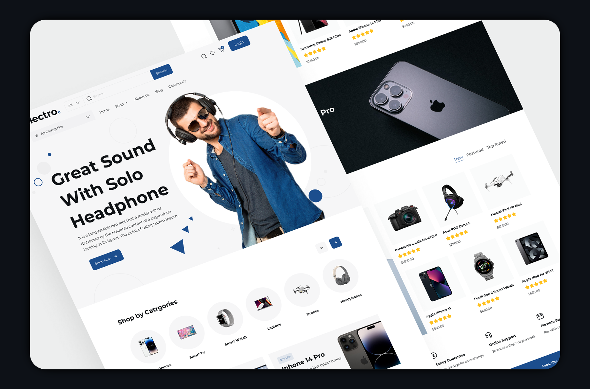

## Web Design Project release/2.0.x

### Description

This repository contains the source code for a university web design project. The project aims to create a user-friendly and responsive website for a university department or organization.

### Features

- Responsive design
- Easy-to-use interface
- ... (Add more features as needed)

--------------------------------------------

Phase 2 Objective:

The goal of this phase is to add JavaScript functionalities to the project's frontend. Complete the project according to the following descriptions:

1. Login Button:

- Clicking the login button should open a login popup.

2. Register Button:

- Clicking the register button within the login popup should open a registration popup.

3. Product Page:

- Clicking on the "Description", "Additional Information", and "Review" tabs on the product page should change the content of the tab without reloading the page.

4. Product Price:

- The product price should change when the color is changed without reloading the page.

5. Product Rating:

- Allow users to rate products using star icons. The submitted rating should be printed in the console on the product page.

6. Add to Cart:

- Clicking the "Add to Cart" button should increase the number displayed on the cart icon at the top of the page.

7. Shopping Cart:

- Clicking the cart icon should open the shopping cart. By default, two products should be displayed in the cart.

8. Remove Item from Cart:

- Clicking the delete icon should remove the corresponding item from the shopping cart.

Additional Notes:

- Use JavaScript to implement all the functionalities.
- Ensure a smooth user experience with proper animations and transitions.
- Consider using a state management library to handle the dynamic changes in the application.
- Implement error handling and validation to ensure a robust user experience.

Please note that this is just a basic translation of the text. You may need to add additional details or modify the requirements based on your specific project needs.
